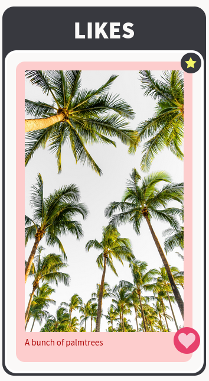

# Syntra assignment: redux exercise

## STUFF to LIKE

**Deployment:**

Visit the app at [https://stufftolike.surge.sh](https://stufftolike.surge.sh).

**Assignment:**

Make a zone with three different media type cards. If the cards are (dis)liked, they appear/disappear on/from a "likes" zone on the right side of the screen.

**The app implements:**

- JavaScript Classes
- combined reducers
- Redux ducks pattern
- local storage
- responsiveness
- Animate.css animation
- a darkmode switch
